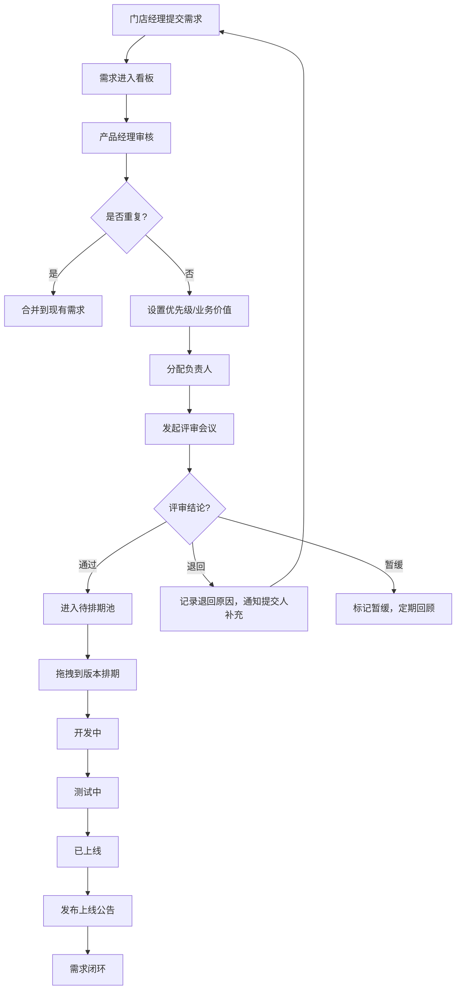

## 1. 产品概述

面向连锁门店总部的需求管理Web应用，用于收集各城市门店的系统改进诉求，实现从需求提交、评审、排期到上线的全流程闭环管理。

- 核心目标：建立标准化的需求收集与处理机制，提升门店诉求响应效率，实现需求全生命周期可视化管理
- 目标用户：门店经理、总部产品经理、研发负责人、运营人员
- 核心价值：统一需求入口、规范评审流程、透明排期进度、量化闭环数据

## 2. 核心功能

### 2.1 用户角色

| 角色 | 核心权限 |
|------|----------|
| 门店经理 | 按模块提交需求、上传截图、查看本人提交的需求进度 |
| 总部产品经理 | 需求看板管理、合并重复项、设置优先级/业务价值、分配负责人、发起评审 |
| 评审人员 | 记录评审结论、填写退回原因、标注待补材料 |
| 版本管理员 | 拖拽需求到版本、记录状态流转、填写延期原因、发布上线公告 |
| 管理层 | 查看统计报表、按多维度筛选分析 |

### 2.2 功能模块

1. **需求看板**：全量需求列表、多维度筛选、搜索、状态概览
2. **提交表单**：需求录入、模块选择、截图上传、影响范围、期望上线时间
3. **评审会议**：评审记录、结论标记、退回原因、待补材料清单
4. **版本排期**：版本管理、拖拽排期、状态流转、延期记录、上线公告
5. **统计报表**：按区域/模块/状态/响应时长生成多维报表

### 2.3 页面详情

| 页面名称 | 模块名称 | 功能描述 |
|---------|---------|----------|
| 需求看板 | 筛选区 | 按状态/模块/区域/优先级/负责人多维度筛选 |
| 需求看板 | 搜索区 | 关键词搜索需求标题和描述 |
| 需求看板 | 需求列表 | 卡片式展示需求概览，支持快速编辑核心字段 |
| 需求看板 | 批量操作 | 批量合并重复需求、批量设置优先级、批量分配 |
| 提交表单 | 基础信息 | 需求标题、模块（收银/库存/会员/报表/其他）、详细描述 |
| 提交表单 | 补充信息 | 截图上传、影响范围（单店/区域/全连锁）、期望上线时间、紧急程度 |
| 提交表单 | 门店信息 | 自动关联提交人所属门店和区域 |
| 评审会议 | 评审列表 | 待评审、已评审、已退回需求分类展示 |
| 评审会议 | 评审记录 | 评审结论（通过/退回/暂缓）、评审意见、待补材料 |
| 评审会议 | 退回管理 | 退回原因记录、补充材料提醒、重新提交流程 |
| 版本排期 | 版本管理 | 创建版本、版本状态（规划中/开发中/测试中/已上线）、版本时间线 |
| 版本排期 | 拖拽排期 | 将未排期需求拖拽到对应版本中 |
| 版本排期 | 状态流转 | 记录需求状态变更历史、延期原因、上线公告 |
| 统计报表 | 区域统计 | 各区域需求数量、处理率、平均响应时长 |
| 统计报表 | 模块统计 | 各模块需求分布、解决率、业务价值分布 |
| 统计报表 | 状态统计 | 全量需求状态分布、积压需求预警 |
| 统计报表 | 响应时长 | 各环节处理时效、超时预警、趋势分析 |

## 3. 核心流程

## 4. 用户界面设计

### 4.1 设计风格
- 设计理念：专业、高效、清晰的企业级B端产品风格，采用深色侧边栏+浅色内容区的经典布局
- 主色调：深邃蓝 `#1e3a5f` 作为品牌主色，体现专业性和信任感
- 辅助色：科技蓝 `#3b82f6` 用于交互元素， emerald `#10b981` 表示成功/通过， amber `#f59e0b` 表示警告/暂缓， rose `#ef4444` 表示拒绝/延期
- 字体：标题使用 "Inter"，正文使用 "Noto Sans SC"，保持良好的中文可读性
- 布局：左侧固定导航栏（260px）+ 顶部面包屑栏 + 主内容区，支持响应式折叠
- 卡片风格：圆角8px，微妙阴影，悬停时轻微上浮效果
- 图标：使用 Phosphor Icons 线性图标，保持简洁统一

### 4.2 页面设计概述

| 页面名称 | 模块名称 | UI元素 |
|---------|---------|--------|
| 需求看板 | 顶部筛选 | 下拉选择器、日期范围、搜索框、重置按钮 |
| 需求看板 | 统计卡片 | 4个统计概览卡片（待处理/评审中/排期中/已上线） |
| 需求看板 | 需求列表 | 表格视图，每行显示需求ID、标题、模块、状态、优先级、门店、负责人、创建时间 |
| 需求看板 | 需求卡片 | 悬停显示完整描述和操作按钮 |
| 提交表单 | 表单布局 | 两列布局，左侧基础信息，右侧补充信息 |
| 提交表单 | 上传组件 | 拖拽上传截图，支持预览和删除 |
| 提交表单 | 提交按钮 | 底部固定操作栏，提交/保存草稿/取消 |
| 评审会议 | 三栏布局 | 待评审/已评审/已退回三列看板 |
| 评审会议 | 评审弹窗 | 模态框展示评审详情，包含结论选择、意见输入、材料清单 |
| 版本排期 | 时间线布局 | 横向版本时间线，每个版本为一列，需求卡片可拖拽 |
| 版本排期 | 状态标签 | 彩色标签标识需求状态，支持点击切换 |
| 统计报表 | 图表区 | ECharts 柱状图/饼图/折线图组合展示 |
| 统计报表 | 数据表格 | 可导出的详细数据表格 |

### 4.3 响应式
- 桌面优先设计，支持1920px及以上分辨率
- 平板端（1024px-1440px）：侧边栏可折叠，表格列数自适应减少
- 移动端（<1024px）：顶部导航，卡片单列布局，表格转为列表展示

### 4.4 交互动效
- 页面加载：顶部进度条 + 内容区域淡入
- 卡片悬停：上浮2px + 阴影加深 + 边框高亮
- 拖拽操作：半透明拖拽预览 + 放置区域高亮
- 状态变更：颜色过渡动画 + 轻微缩放反馈
- 表单校验：错误提示抖动动画 + 红框高亮
