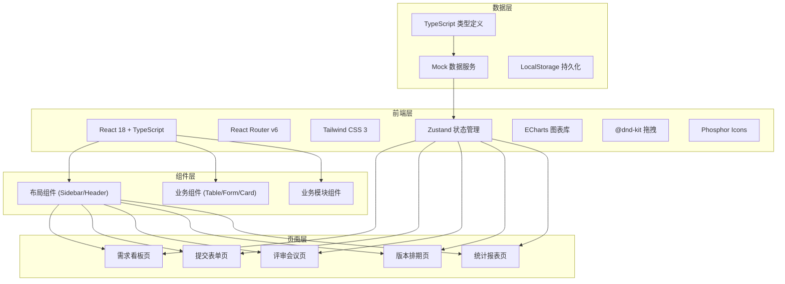
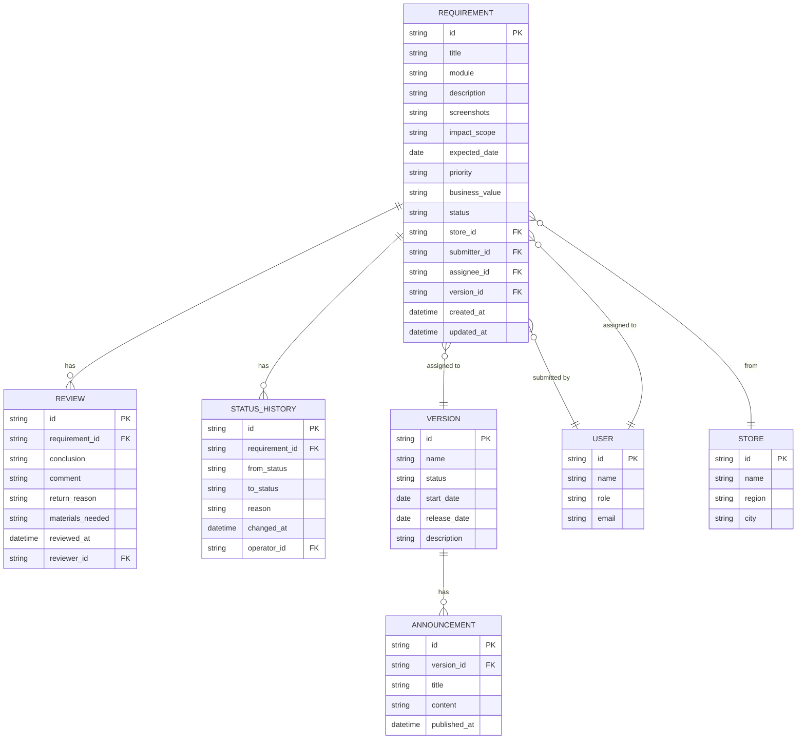

## 1. 架构设计



## 2. 技术栈说明

- **前端框架**: React 18 + TypeScript 5
- **构建工具**: Vite 5
- **路由管理**: React Router v6
- **样式方案**: Tailwind CSS 3
- **状态管理**: Zustand
- **UI 组件**: 自定义业务组件（无第三方UI库依赖）
- **图表库**: ECharts 5
- **拖拽库**: @dnd-kit
- **图标库**: Phosphor React
- **数据持久化**: LocalStorage
- **数据来源**: 内置 Mock 数据

## 3. 路由定义

| 路由 | 页面 | 说明 |
|------|------|------|
| / | 需求看板 | 首页，需求列表与筛选 |
| /submit | 提交表单 | 新建需求表单 |
| /submit/:id | 提交表单 | 编辑需求表单 |
| /review | 评审会议 | 评审看板与操作 |
| /schedule | 版本排期 | 版本管理与拖拽排期 |
| /statistics | 统计报表 | 多维度数据统计 |

## 4. 数据模型

### 4.1 实体关系图



### 4.2 TypeScript 类型定义

```typescript
// 需求状态
type RequirementStatus = 
  | 'pending'
  | 'reviewing'
  | 'approved'
  | 'scheduled'
  | 'developing'
  | 'testing'
  | 'online'
  | 'rejected'
  | 'deferred';

// 模块类型
type ModuleType = 'cashier' | 'inventory' | 'member' | 'report' | 'other';

// 优先级
type Priority = 'critical' | 'high' | 'medium' | 'low';

// 业务价值
type BusinessValue = 'high' | 'medium' | 'low';

// 影响范围
type ImpactScope = 'single' | 'regional' | 'chainwide';

// 评审结论
type ReviewConclusion = 'approved' | 'rejected' | 'deferred';

interface Store {
  id: string;
  name: string;
  region: string;
  city: string;
}

interface User {
  id: string;
  name: string;
  role: string;
  email: string;
  storeId?: string;
}

interface Requirement {
  id: string;
  title: string;
  module: ModuleType;
  description: string;
  screenshots: string[];
  impactScope: ImpactScope;
  expectedDate: string;
  priority: Priority;
  businessValue: BusinessValue;
  status: RequirementStatus;
  storeId: string;
  submitterId: string;
  assigneeId?: string;
  versionId?: string;
  createdAt: string;
  updatedAt: string;
}

interface Review {
  id: string;
  requirementId: string;
  conclusion: ReviewConclusion;
  comment: string;
  returnReason?: string;
  materialsNeeded?: string[];
  reviewedAt: string;
  reviewerId: string;
}

interface StatusHistory {
  id: string;
  requirementId: string;
  fromStatus: RequirementStatus;
  toStatus: RequirementStatus;
  reason?: string;
  changedAt: string;
  operatorId: string;
}

interface Version {
  id: string;
  name: string;
  status: 'planning' | 'developing' | 'testing' | 'released';
  startDate: string;
  releaseDate: string;
  description: string;
}

interface Announcement {
  id: string;
  versionId: string;
  title: string;
  content: string;
  publishedAt: string;
}
```

## 5. 项目结构

```
src/
├── types/              # TypeScript 类型定义
│   └── index.ts
├── store/             # Zustand 状态管理
│   ├── useRequirementStore.ts
│   ├── useReviewStore.ts
│   ├── useVersionStore.ts
│   └── useUserStore.ts
│   └── useStore.ts
├── mock/              # Mock 数据
│   ├── requirements.ts
│   ├── reviews.ts
│   ├── versions.ts
│   ├── users.ts
│   └── stores.ts
├── components/        # 通用组件
│   ├── layout/
│   │   ├── Sidebar.tsx
│   │   ├── Header.tsx
│   │   └── Layout.tsx
│   ├── ui/
│   │   ├── Button.tsx
│   │   ├── Input.tsx
│   │   ├── Select.tsx
│   │   ├── Table.tsx
│   │   ├── Modal.tsx
│   │   ├── Card.tsx
│   │   ├── Badge.tsx
│   │   ├── Tag.tsx
│   │   └── Upload.tsx
│   │   └── DatePicker.tsx
│   └── common/
│       ├── StatusBadge.tsx
│       ├── PriorityBadge.tsx
│       └── RequirementCard.tsx
├── pages/           # 页面组件
│   ├── Board/
│   │   ├── index.tsx
│   │   ├── FilterBar.tsx
│   │   ├── StatsCards.tsx
│   │   └── RequirementTable.tsx
│   ├── Submit/
│   │   ├── index.tsx
│   │   ├── BasicInfoForm.tsx
│   │   └── SupplementForm.tsx
│   ├── Review/
│   │   ├── index.tsx
│   │   ├── ReviewColumn.tsx
│   │   └── ReviewModal.tsx
│   ├── Schedule/
│   │   ├── index.tsx
│   │   ├── VersionColumn.tsx
│   │   ├── DraggableCard.tsx
│   │   └── VersionModal.tsx
│   │   └── AnnouncementModal.tsx
│   └── Statistics/
│       ├── index.tsx
│       ├── RegionChart.tsx
│       ├── ModuleChart.tsx
│       ├── StatusChart.tsx
│       ├── DurationChart.tsx
│       └── DataTable.tsx
├── utils/             # 工具函数
│   ├── date.ts
│   ├── format.ts
│   └── constants.ts
├── hooks/             # 自定义 Hooks
│   └── useDragDrop.ts
├── App.tsx
├── main.tsx
└── index.css
```

## 6. 核心功能实现要点

### 6.1 状态管理（Zustand）

```typescript
// 需求状态管理
- 需求CRUD操作
- 筛选条件管理
- 状态流转逻辑
- 合并需求逻辑

### 6.2 拖拽排期（@dnd-kit）

```typescript
// 版本排期拖拽
- 未排期池 <-> 版本列
- 版本内排序
- 版本间移动
- 状态自动更新
```

### 6.3 图表（ECharts）

```typescript
// 统计图表
- 区域统计：柱状图 + 折线图组合
- 模块统计：饼图
- 状态统计：堆叠柱状图
- 响应时长：折线图趋势
```

### 6.4 表单验证

```typescript
// 表单校验规则
- 必填项校验
- 日期合法性
- 附件格式校验
- 自定义业务规则校验
```
